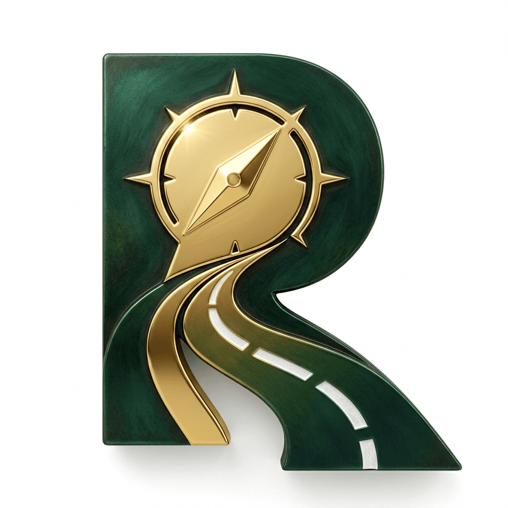

# RQuest

  

### A connected research workspace.

**Read. Organise. Think. Write. Present.**

RQuest is a desktop research workspace designed to help you bring your research sources, reading, notes, evidence, ideas, and writing into one connected environment.

From reading and annotating research papers to developing ideas, building arguments, creating research artefacts, and preparing manuscripts, RQuest is designed around the complete research process.

## Download RQuest

RQuest builds are distributed through GitHub Releases.

**[Download the latest release](https://github.com/piyushdongre-dot-com/RQuest/releases/latest)**

Available builds may include:

- macOS
- Windows
- Linux

Check the latest release for the currently available platforms and installers.

## What RQuest Provides

RQuest brings different stages of research into one workspace:

- Source and reference management
- PDF reading and annotations
- Research notes
- Claims and evidence
- Research synthesis
- Diagrams and mind maps
- Research artefacts
- Manuscripts
- Presentations
- AI-assisted research
- Local research vault

The research process can evolve from:

**Question → Sources → Reading → Evidence → Notes → Synthesis → Concepts → Claims → Arguments → Manuscripts → Presentations**

## RQuest Pro

RQuest Pro is the professional version of RQuest with additional features for advanced research workflows.

**[Get RQuest Pro](https://rquest.in/shop/)**

RQuest Pro is available as:

- **RQuest Pro**: Desktop application
- **RQuest Pro Bundle**: Desktop + Companion Mobile App + Web Vault Manager

## Desktop, Mobile and Web

The RQuest Pro Bundle extends the desktop research workspace with companion experiences:

**RQuest Pro Desktop**

The full research environment for reading, organising, writing, synthesis, diagrams, manuscripts, presentations, and other research activities.

**RQuest Companion**

A mobile companion for accessing your research vault, reviewing research, and capturing ideas while away from your computer.

**RQuest Web Vault Manager**

A browser-based interface for accessing and managing your research vault.

## LaTeX and Typst

RQuest supports LaTeX and Typst workflows on the desktop application.

> **LaTeX and Typst compilation is currently available only on RQuest Pro Desktop.**

The mobile and web applications are companion experiences and do not provide the full desktop compilation environment.

## Free and Pro

The RQuest Free builds are available for download from this repository.

RQuest Pro provides additional capabilities for users who need a more complete research workflow.

The free and Pro products are distributed separately.

## Releases

Each release contains the builds and release notes for that version.

For previous versions, visit the:

**[RQuest Releases](https://github.com/piyushdongre-dot-com/RQuest/releases)**

## Documentation

Documentation and guides will be made available as the RQuest project develops.

## Feedback and Support

For questions, feedback, or issues related to a specific release, use the available support channels provided on the RQuest website.

## About RQuest

RQuest is built around a simple idea:

> Research should be connected.

Your sources, evidence, ideas, notes, arguments, and outputs should form part of the same research process.

**RQuest**

*Read. Organise. Think. Write. Present.*